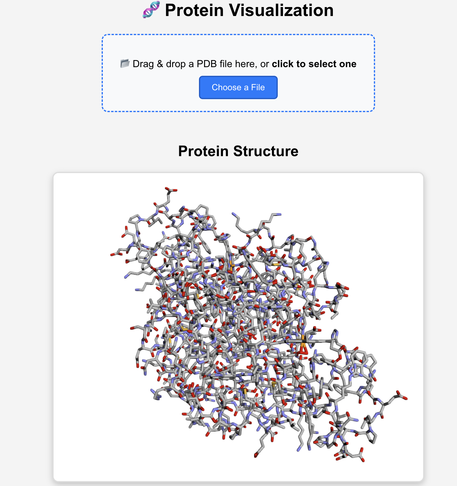

# 🧬 Protein Visualization Web App

📌 Overview

This project is a React-based web application for visualizing Protein Data Bank (PDB) files. Users can upload PDB files, and the app will render 3D molecular structures using 3Dmol.js. The application is also Dockerized, making it easy to deploy anywhere.



## 🔬 About PDB Files & Bioinformatics Background

### 🏛 What is the Protein Data Bank (PDB)?

The Protein Data Bank (PDB) is a publicly available repository containing 3D structural data of biomolecules such as proteins, DNA, and RNA. These structures are crucial in bioinformatics, drug discovery, and computational biology.

- Official PDB website: https://www.rcsb.org/
- Example PDB file download: Hemoglobin Structure (PDB ID: 2COK)

#### 🔹 Importance in Bioinformatics

- Structural Biology: Helps in studying molecular interactions and functions.
- Drug Discovery: Used in computational drug design and molecular docking.
- AI & Machine Learning: Used in protein structure prediction (e.g., AlphaFold).
- Genomics & Proteomics: Helps in functional annotation of proteins.

## 🚀 Features
- Upload PDB files to visualize 3D molecular structures.
- Uses 3Dmol.js for interactive protein rendering.
- Clean React.js UI with drag-and-drop upload.
- Dockerized for easy deployment.
- Modern CSS Styling for a smooth user experience.
- Supports multiple protein rendering styles.

## 🏗 Technologies & Frameworks Used
- Frontend: React.js, JavaScript, HTML, CSS
- 3D Visualization: `3Dmol.js`
- File Upload Handling: `react-dropzone`
- Containerization: Docker

## 📥 Installation & Setup
1. Clone the Repository
```bash
git clone https://github.com/your-username/protein-visualization.git
cd protein-visualization
```
2. Install Dependencies
```bash
npm install
```
3. Start the Development Server
```bash
npm start
```
Now open http://localhost:3000 in your browser.

## 🐳 Running the Docker Image
To pull and run the Docker image from Docker Hub:
```bash
docker pull your-dockerhub-username/protein-visualization
docker run -p 3000:3000 your-dockerhub-username/protein-visualization
```
Now the app should be accessible at http://localhost:3000.

## 📂 Project Structure
```text
protein-visualization/
│── public/                      # Static assets
│── src/                         # Source code
│   ├── components/              # React components
│   │   ├── FileUpload.js        # Handles file upload
│   │   ├── ProteinVisualizer.js # Renders 3D protein structures
│   ├── App.js                   # Main app component
│── Dockerfile                   # Docker setup
│── package.json                 # Project dependencies
│── README.md                    # Project documentation
```
